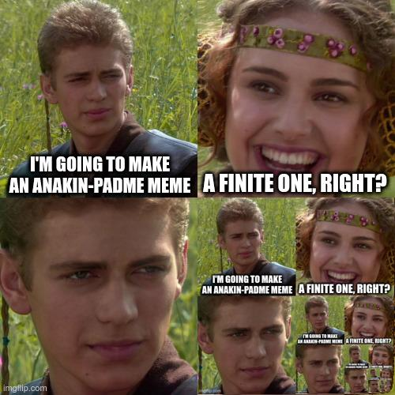

# droste-effect
Create an infinitely recursive image

Just a fun project because I wanted to :)



# Usage
```
usage: droste.py [-h] -i INPUT_FILENAME -o OUTPUT_FILENAME -tl TL TL -br BR BR [-L LIMIT] [--verbose]

Create the droste effect

options:
  -h, --help            show this help message and exit
  -i INPUT_FILENAME     Path to input file (image)
  -o OUTPUT_FILENAME    Path to output file (image)
  -tl TL TL, --top-left TL TL
                        Coordinates of the top left pixel to start the Droste effect in
  -br BR BR, --bottom-right BR BR
                        Coordinates of the bottom right pixel to start the Droste effect in
  -L LIMIT, --limit LIMIT
                        Recursion limit for the effect
  --verbose, -v         Enable verbose output
  ```
  
# Example
Create the image in the README using the input file `ip.jpg` and save it to the output file `op.jpg`:
`./droste.py -i ./ip.jpg -o ./op.jpg -tl 250 250 -br 499 499 -v`
 
